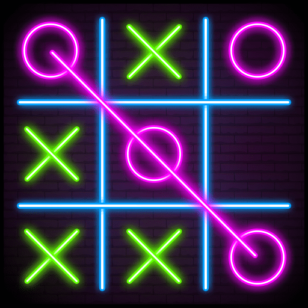

<h1 align="center">Tic_Tac_Toe | Jogo da Velha</h1>

 <a href="#computer-sobre">• Sobre o Jogo</a> | 
 <a href="#memo-roteiro">• Roteiro</a> | 
 <a href="#hammer-tecnologias">• Tecnologias</a> | 
 <a href="#boy-autor">• Autor</a> 

## :computer: **Sobre o Jogo**

<h2>Regras e objetivos do jogo da velha</h2>
As regras do jogo são bem simples. 

    O jogo é um tabuleiro, desenhado com três linhas e três colunas. Os espaços em branco dessas linhas e colunas serão preenchidos com os símbolos escolhidos. 
    Cada jogador terá uma oprtunidade por vez de escolher e marcar seu lugar escolhido com seu símbolo. 
    O objetivo desse passatempo é preencher ou as linhas diagonais ou as horizontais ou as verticais com um mesmo símbolo (X ou O) e impedir que seu adversário faço isso primeiro que você.

    <h3>Curiosidades sobre o jogo</h3>
    

    O jogo tem registros dele em escavações feitas no templo de Kurna, no Egito datadas no século 14. Não apenas foi encontrado registros do jogo da velha nessa região como também na China antiga, na América pré-colombiana e no Império Romano. 
    Mas, foi na Inglaterra do século 19 que esse jogo se popularizou e ganhou esse nome. Quando as mulheres inglesas se reuniam na hora do chá para bordar, tinha aquelas mais velhas que não conseguiam mais fazer este ofício. Muito dessas senhoras já apresentavam problemas de vista e não enxergavam o suficiente para conseguir bordar. A priori, a solução para conseguirem um novo passatempo foi jogar o jogo de velha. E é por isso que ele recebe este nome: porque era jogado por velhas. 
    O jogo da velha ajuda no desenvolvimento do raciocínio, da lógica, estratégia e resolução de problemas, prever o movimento do adversário, aprender a formar sequência e ter paciência.

 

## :memo: **Roteiro**

    Desafio pratico de criação do Jogo da Velha. 
    Jogo da Velha desenvolvido com o intuito de estudar e produzir um jogo de forma simples e com pouco código, aproveitando  somente os recursos oferecidos nativamente pelo Javascript. 
    Nesse projeto foi utilizando HTML5, CSS3 e Javascript. Sendo abordado os conceitos básicos sobre linguagens e usando lógica para progemação.

## :hammer: **Tecnologias**

 HTML para estruturar nosso site;  
 JavaScript para criarmos toda suas interações; 
 CSS para estilizar e dar vida a ele. 

## :girl: **Autora**

Feito por Alane G. Brito ❤️

